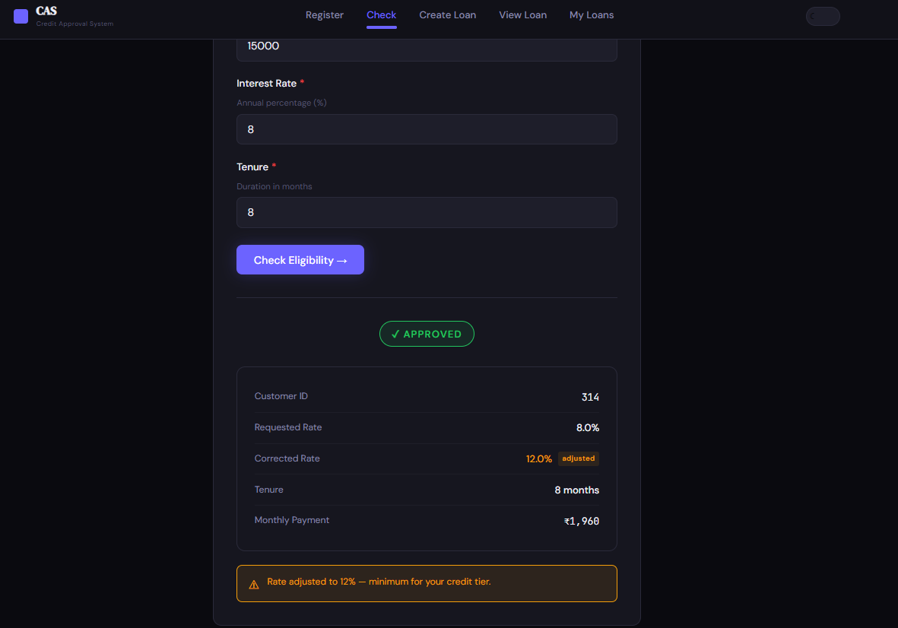
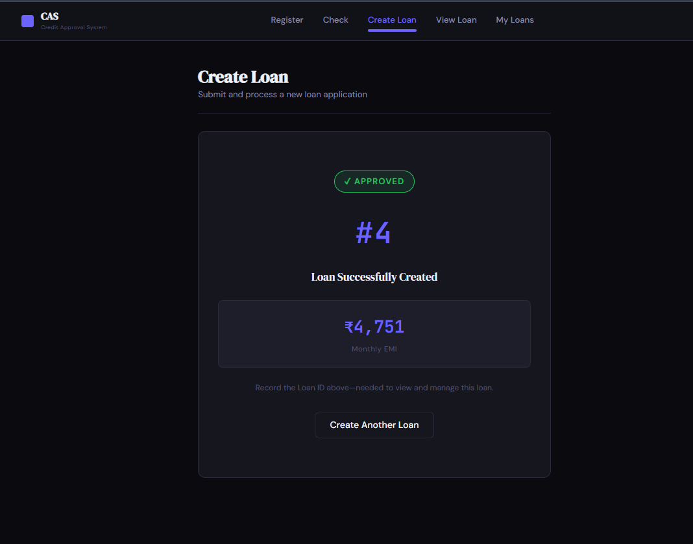
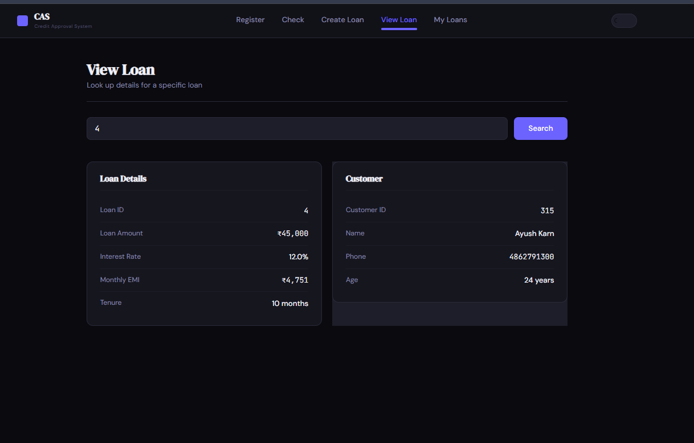
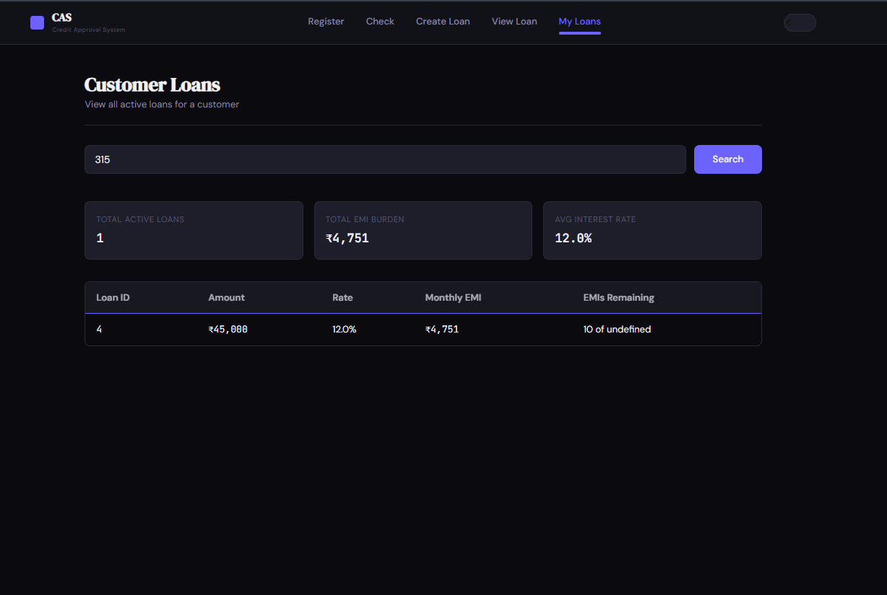

# Credit Approval System

Django REST API + React frontend for automated credit scoring and loan approval.

## Quick Start

Prerequisites: Docker and Docker Compose

```bash
docker-compose up --build
```

**Access the app**: http://localhost:3000 (frontend)  
**API**: http://localhost:8000  

Services start automatically:
- ✅ React frontend (port 3000)
- ✅ Django API (port 8000)
- ✅ PostgreSQL database
- ✅ Redis cache
- ✅ Celery worker

## Features

### 5 Pages
1. **Register Customer** - Create new customer with auto-calculated credit limit
2. **Check Eligibility** - Preview loan terms and interest rate adjustments
3. **Create Loan** - Submit loan application (instant approval/denial)
4. **View Loan** - Lookup specific loan by ID with customer details
5. **Customer Loans** - Table of all active loans for a customer

### Credit Scoring
- Automatic credit score calculated (0-100)
- Interest rate adjusted based on score
- Approval/denial based on EMI burden (max 50% of salary)
- All data pre-loaded: 300 customers + 753 loans

## Frontend Screenshots


### Check Eligibility


### Create Loan


### View Loan


### Customer Loans


## Frontend

React 18 + Vite web UI:
- Plain CSS styling (government/banking theme)
- Responsive design (mobile, tablet, desktop)
- Client-side form validation
- Indian rupee formatting
- No animations, no gradients (clean, professional)

See [frontend/README.md](frontend/README.md) for detailed docs.

## API Endpoints

### 1. Register Customer
```
POST /register
Body: { first_name, last_name, age, monthly_income, phone_number }
```

### 2. Check Eligibility
```
POST /check-eligibility
Body: { customer_id, loan_amount, interest_rate, tenure }
```

### 3. Create Loan
```
POST /create-loan
Body: { customer_id, loan_amount, interest_rate, tenure }
```

### 4. View Loan
```
GET /view-loan/<loan_id>
```

### 5. View Customer Loans
```
GET /view-loans/<customer_id>
```

## Tech Stack

**Backend:** Django 4.2, PostgreSQL 15, Redis 7, Celery, Gunicorn

**Frontend:** React 18, Vite, React Router v6, Axios, Plain CSS

**Infrastructure:** Docker & Docker Compose, Automated Excel import

## Credit Scoring

| Factor | Points |
|--------|--------|
| On-time EMI | 35 |
| Loan experience | 20 |
| Recent activity | 20 |
| Loan volume | 25 |

Interest rate: Adjusted based on score (Score ≤ 10 = Denied)

## Quick Commands

```bash
docker-compose logs web              # View backend logs
docker-compose logs frontend         # View frontend logs
docker-compose exec db psql -U credit_user -d credit_db  # Database
docker-compose exec web pytest       # Run tests
docker-compose down                  # Stop all services
```

## Project Structure

```
alemeno/
├── frontend/          # React 18 + Vite UI
├── apps/              # Django apps (customers, loans, ingestion, common)
├── config/            # Django settings
├── data/              # Excel files (pre-loaded)
└── docker-compose.yml # Services config
```

## Environment Setup

`.env` file:
```
DB_NAME=credit_db
DB_USER=credit_user
DB_PASSWORD=credit_pass
DB_HOST=db
DB_PORT=5432
REDIS_URL=redis://redis:6379/0
```

## Notes

- **CORS enabled** for frontend-backend communication
- **Auto-migrations** on startup
- **Pre-loaded data**: 300 customers, 753 loans
- **Credit limit** = 36 × monthly_income / 100,000 × 100,000
- **Approval** = EMI ≤ 50% of monthly salary

## Support

Detailed frontend docs: [frontend/README.md](frontend/README.md)
